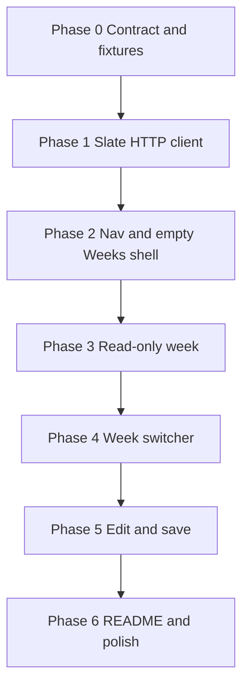

# Weekly duel editor — phased implementation

This is the step-by-step build order for [weekly-duel-editor.md](weekly-duel-editor.md). Each phase is independently checkable. Do not start a later Flask phase until the previous one’s exit criteria pass.

The other-repo HTTPS API can be built in parallel with Phases 0–4. Flask save (Phase 5) needs a live `PUT` endpoint or a local stub.

**Firestore IDs (fixtures and API):** week document IDs are numeric strings (`"15"`); duel document IDs match each duel’s `id` field (`"qb"`, `"rb"`, `"wr"`). JSON fixtures themselves cannot hold comments.



---

## Phase 0 — Freeze the API contract and fixtures

**Goal:** Anyone implementing the other repo or the Flask client has the same request/response shapes and sample payloads.

**Files**

- Keep [weekly-duel-editor.md](weekly-duel-editor.md) as the contract source of truth
- Add `docs/fixtures/slates.json` — `{ "weeks": [14, 15, 16] }`
- Add `docs/fixtures/slate-week-15.json` — one `GET /slates/15` body with 2–3 duels (copy `payload.json` for the first, vary `id` / players for the rest)
- Add `docs/fixtures/put-duel-ok.json` — `{ "ok": true, "duel": { ... } }`

**Steps**

1. Copy `payload.json` into the week fixture; add at least one more duel (`id` `rb` or similar) so the UI can be built against a list, not a singleton.
2. Ensure every duel in the fixture is a valid `MatchupPayload` (`week`, `id`, `lockedAtUtc`, `freezeAtUtc`, `playerA`, `playerB` with the six player keys).
3. Note in the fixture file (comment at top of this plan, not inside JSON): week document IDs are numeric strings (`"15"`); duel document IDs match `id`.

**Exit criteria**

- [x] Three fixture files exist and parse as JSON
- [x] A week fixture contains more than one duel
- [x] Other-repo work can start without waiting on Flask

**Does not include:** any Python or template changes.

---

## Phase 1 — `scripscrap/slate.py` HTTP client

**Goal:** All Firestore access from this app goes through one urllib client, matching `scripscrap/matchup.py`.

**Files**

- Add [`scripscrap/slate.py`](../scripscrap/slate.py)
- Reuse [`scripscrap/matchup.py`](../scripscrap/matchup.py) (`parse_matchup_payload`, `MatchupPayload`) — do not duplicate validation

**Steps**

1. Constants: `URL_ENV_VAR = "SLATE_API_URL"`, `TOKEN_ENV_VAR = "SLATE_API_TOKEN"`.
2. `base_url()` — read env, strip trailing slash, raise `SlateError` if missing/blank.
3. Shared `_request(method, path, json_body=None)`:
   - Headers: `Accept: application/json`; `Content-Type` when there is a body
   - Optional `Authorization: Bearer …` when token is set
   - Timeout 30s
   - Map `URLError` → `SlateError`
   - Return a small dataclass (`status_code`, `text`, `data`, `ok`) like `MatchupResponse`
4. `list_weeks() -> list[int]`:
   - `GET {base}/slates`
   - Require `data["weeks"]` to be a list; coerce each to int; sort; reject non-integers
   - Non-2xx → `SlateError` with status + truncated body
5. `get_week(week: int) -> list[MatchupPayload]`:
   - `GET {base}/slates/{week}`
   - Require `data["duels"]` list
   - For each item, inject `week` if missing, inject `id` from a `id` field only (document id is the API’s job)
   - Run `parse_matchup_payload`; collect `MatchupValidationError` into one `SlateError` naming the bad index/`id`
6. `put_duel(payload: MatchupPayload)`:
   - `PUT {base}/slates/{week}/duels/{id}` with `json.dumps(payload)`
   - Return the response dataclass; do not raise on 4xx (caller flashes), raise `SlateError` on network failure only — same split as `post_matchup`

**Exit criteria**

- [x] Module imports; no Flask dependency
- [x] Missing `SLATE_API_URL` raises a clear `SlateError` (not a stack from urllib)
- [x] No Firebase / `google-cloud-firestore` dependency

**Manual check:** with a stub or the real API:

```bash
export SLATE_API_URL="https://example.invalid"
python -c "from scripscrap.slate import list_weeks; list_weeks()"
```

Expect a `SlateError`, not an uncaught exception.

---

## Phase 2 — Navigation and empty Weeks shell

**Goal:** The Weeks section exists in the UI and degrades cleanly when the API is unset. No live data required.

**Files**

- Change [`scripscrap/templates/base.html`](../scripscrap/templates/base.html)
- Add [`scripscrap/templates/weeks.html`](../scripscrap/templates/weeks.html)
- Change [`scripscrap/web.py`](../scripscrap/web.py)
- Change [`scripscrap/static/style.css`](../scripscrap/static/style.css) only as needed for header nav (`.site-nav`)

**Steps**

1. In `base.html`, add a header nav: Home (`url_for('index')`) and Weeks (`url_for('weeks_index')`). Keep the logo pointing at `/`.
2. Add `GET /weeks` named `weeks_index`:
   - If `SLATE_API_URL` is unset: render `weeks.html` with `week=None`, `weeks=[]`, `duels=[]`, `configured=False`, and a muted lede: set `SLATE_API_URL` (and optional token) and restart.
   - If configured: try `list_weeks()`; on `SlateError`, flash error and render the same empty template (`configured=True`).
   - If weeks exist: `redirect` to `url_for("show_week", week=max(weeks))`.
   - If weeks is empty: render empty state (“No slates yet”).
3. Add a stub `GET /weeks/<int:week>` named `show_week` that renders the same template with `duels=[]` and the requested `week` (real fetch is Phase 3). Skip this stub if you implement Phase 3 in the same sitting — but the empty `/weeks` path must work first.
4. `weeks.html`: title “Weeks”, panel, lede, empty copy. No duel forms yet.

**Exit criteria**

- [x] Header shows Weeks on every page (home and source)
- [x] With env unset: `/weeks` shows the configure message, no traceback
- [x] Home page and Post matchup form are unchanged

**Browser check:** open `/`, click Weeks, confirm empty/configure state; click logo back to home.

---

## Phase 3 — Read-only week view

**Goal:** Choosing a week shows its duels as cards. Still no editing.

**Files**

- Change [`scripscrap/web.py`](../scripscrap/web.py) (`show_week`)
- Change [`scripscrap/templates/weeks.html`](../scripscrap/templates/weeks.html)
- Change [`scripscrap/static/style.css`](../scripscrap/static/style.css)

**Steps**

1. `show_week(week)`:
   - `week < 1` → 404 or redirect with flash
   - Call `list_weeks()` (for the switcher later) and `get_week(week)`
   - On `SlateError`: flash, render with `duels=[]`
   - Pass `duels` through `matchup_form_values` so datetime fields are form-ready even in read-only
2. Template: one `.panel.duel-card` per duel:
   - Header: `duel.id` (uppercase) and `playerA.name vs playerB.name`
   - Read-only rows: lock, freeze, each player’s slug/name/team/pos/opponent/proj
   - Empty list: “No duels for week {n}.”
3. CSS: `.weeks-page` slightly wider (`max-width: 1100px` on `body.weeks` or wrap); duel card header; reuse `.players` / `.row`.
4. Set `body` class or a wrapper so only this page is wider, not the scraper pages.

**Exit criteria**

- [x] `/weeks/15` (or whatever exists) lists every duel from the API
- [x] Bad/malformed duel from API flashes and does not 500 the page
- [x] Unknown week still renders (empty duels + optional flash)

**Browser check:** with API configured, `/weeks` redirects to the highest week and cards show names, teams, projs.

---

## Phase 4 — Week switcher

**Goal:** Move between slates without editing the URL by hand.

**Files**

- Change [`scripscrap/templates/weeks.html`](../scripscrap/templates/weeks.html)
- Change [`scripscrap/static/style.css`](../scripscrap/static/style.css)
- Tiny inline script on the weeks template only

**Steps**

1. Week bar at top of `weeks.html`:
   - Heading `Week {week}`
   - Prev link: previous integer in the sorted `weeks` list, or a disabled `.button.secondary` if none
   - Next link: same
   - `<select name="week">` of all `weeks`; current week selected; if current week is not in the list, include it as an extra option so the control stays honest
2. On `<select>` `change`, `window.location = "/weeks/" + value` (use `url_for` prefix if you ever mount under a path; today it is root).
3. `show_week` always passes `weeks` (sorted) plus `prev_week` / `next_week` (or compute in Jinja).
4. `/weeks` continues to redirect to `max(weeks)` when the list is non-empty.

**Exit criteria**

- [x] Prev/next and the select all land on `/weeks/<n>`
- [x] At the first/last week, the corresponding control is disabled
- [x] Direct visit to `/weeks/99` is shareable and does not crash

**Browser check:** walk every available week with prev, next, and the dropdown.

---

## Phase 5 — Edit fields and PUT back

**Goal:** Each duel is a form; Save writes through the slate API.

**Files**

- Change [`scripscrap/web.py`](../scripscrap/web.py)
- Change [`scripscrap/templates/weeks.html`](../scripscrap/templates/weeks.html)
- Reuse form field names from [`scripscrap/templates/index.html`](../scripscrap/templates/index.html) (`week`, `id`, `lockedAtUtc`, `freezeAtUtc`, `playerA_*`, `playerB_*`)

**Steps**

1. Convert each duel card to `<form method="post" action="{{ url_for('save_duel', week=week, duel_id=duel.id) }}">`.
2. Hidden inputs for `week` and `id` (id not editable in v1 so the path stays stable). Visible inputs match the home matchup form (datetime-local, player fields). Prefill via `matchup_form_values`.
3. `POST /weeks/<int:week>/duels/<duel_id>` named `save_duel`:
   - `raw = matchup_from_form(request.form)`
   - If form `id` or `week` disagrees with the URL, flash error and redirect (do not PUT)
   - `parse_matchup_payload(raw)` → flash `MatchupValidationError`, redirect, no PUT
   - `put_duel(payload)`:
     - `SlateError` → flash
     - `result.ok` → flash “Saved {id} for week {n}.”
     - else → flash status + truncated body (same 240-char pattern as `send_matchup`)
   - Always `redirect(url_for("show_week", week=week))`
4. One **Save duel** button per card. Do not add a page-level save-all in v1.

**Exit criteria**

- [x] Validation errors never call PUT
- [x] Successful save survives reload
- [x] Failed PUT (401/400/5xx) flashes and leaves the user on the same week
- [x] Home **Post matchup** still POSTs to add-matchup only

**Browser check:** change a projection, save, reload; clear a required name, submit, confirm flash and no write; switch week, confirm the other week’s data is untouched.

---

## Phase 6 — README, env notes, and final polish

**Goal:** A new clone can run the Weeks UI from the README alone.

**Files**

- Change [`README.md`](../README.md)
- Optionally one-line pointer at the top of [weekly-duel-editor.md](weekly-duel-editor.md)

**Steps**

1. README: new subsection under “Run the web app”:
   - Weeks page at `/weeks`
   - `SLATE_API_URL` (required for Weeks; no trailing slash)
   - `SLATE_API_TOKEN` (optional Bearer)
   - Example exports next to `ADD_MATCHUP_TOKEN`
   - Link to this docs folder for the API contract
2. Home-page bullet: browse/edit weekly duels on Weeks (distinct from Post matchup).
3. CSS pass: mobile (already stacks `.players` at 640px); week bar wrap; save button spacing.
4. Confirm `.env` stays gitignored; no secrets in docs.

**Exit criteria**

- [x] README lists both token env vars and both matchup-related features
- [x] Unset API still documented as a supported empty state

---

## Parallel track — other repo (not this codebase)

Can start after Phase 0. Flask Phase 3 needs `GET /slates` and `GET /slates/<week>`; Phase 5 needs `PUT`.

| Step | Endpoint | Firestore |
|------|----------|-----------|
| A | Auth middleware (Bearer) | — |
| B | `GET /slates` | list `slates` document IDs → sorted ints |
| C | `GET /slates/<week>` | `slates/{week}/duels/*`; inject `week` / `id` |
| D | `PUT /slates/<week>/duels/<duelId>` | `set`/`update` nested player maps |
| E | Smoke against a real slate doc; keep a copy of the JSON as a fixture if it differs |

Week IDs must be `"15"`-style strings. Do not stringify `playerA` / `playerB`.

---

## Suggested sitting order

If implementing in this repo only (API already exists): **1 → 2 → 3 → 4 → 5 → 6** in one PR is fine, but merge/test after 3 (read-only) before wiring PUT.

If the API is not ready: **0 → 1 → 2**, then pause. Phase 2 is usable without a backend.

---

## Out of scope (all phases)

- Create or delete duels (home Post matchup remains the create path)
- Editing `id` or moving a duel to another week
- Firebase SDK in this repo
- Live listeners / optimistic locking
- Automated test suite (add later if `slate.py` parsing gets painful)
