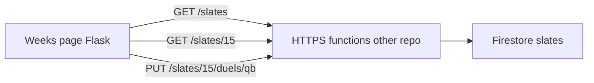

# Weekly matchup viewer and editor

Flask setup (`/weeks`, `SLATE_API_URL`, `SLATE_API_TOKEN`) is in the [README](../README.md) under “Run the web app”.

Add a dedicated Weeks page to the Flask app that lists duels for a chosen slate week via a new HTTPS API (implemented in another repo against `slates/{week}/duels/{duelId}`), lets you edit each duel in the existing matchup field shape, and PUTs changes back.

Build order: [weekly-duel-editor-phases.md](weekly-duel-editor-phases.md).

## Implementation checklist

- [x] Phase 0 — Freeze the API contract and fixtures
- [x] Phase 1 — `scripscrap/slate.py` HTTP client
- [x] Phase 2 — Navigation and empty Weeks shell
- [x] Phase 3 — Read-only week view
- [x] Phase 4 — Week switcher
- [x] Phase 5 — Edit fields and PUT back
- [x] Phase 6 — README, env notes, and final polish

## Context

scripscrap is a local Flask app with no Firestore client. Matchups today are **write-only**: the home-page form POSTs a [`MatchupPayload`](../scripscrap/matchup.py) to Cloud Run (`add-matchup`). There is no week list, no read path, and no “duel” type.

Confirmed:

- Firestore path: `slates/{weekNumber}/duels/{duelId}`
- Duel fields: same as [`payload.json`](../payload.json) (`id`, `lockedAtUtc`, `freezeAtUtc`, `playerA`, `playerB`; `week` comes from the slate path)
- The HTTPS API lives in **another repo**; this plan defines the contract and the Flask UI that consumes it

The existing **Post matchup** form stays on the home page as the create path. The new page is browse + edit.



## API contract (other repo)

Implement these behind one HTTPS function (Express-style routing is fine) or equivalent Cloud Run routes. Auth: `Authorization: Bearer <token>` (same idea as `ADD_MATCHUP_TOKEN`).

**List weeks** — `GET /slates`

- List document IDs in collection `slates`
- Response: `{ "weeks": [14, 15, 16] }` (integers, sorted)

**Get a week** — `GET /slates/<week>`

- Read `slates/{week}/duels/*`
- Response:

```json
{
  "week": 15,
  "duels": [
    {
      "week": 15,
      "id": "qb",
      "lockedAtUtc": "2026-12-14T18:00:00Z",
      "freezeAtUtc": "2026-12-17T17:00:00Z",
      "playerA": { "slug": "...", "name": "...", "teamAbbr": "...", "opponent": "...", "pos": "...", "proj": 24.1 },
      "playerB": { }
    }
  ]
}
```

- Each duel must round-trip as a `MatchupPayload`. Inject `week` from the path if the Firestore doc omits it. Use the **document ID** as `id` if the field is missing.
- Empty week: `{ "week": 15, "duels": [] }` (404 only if the slate doc itself does not exist — or still return empty duels; Flask will show an empty state either way)

**Update a duel** — `PUT /slates/<week>/duels/<duelId>`

- Body: full `MatchupPayload` (same JSON as today’s add-matchup POST)
- Write to `slates/{week}/duels/{duelId}` (do not rely on `week`/`id` in the body for the path)
- Persist: `id`, `lockedAtUtc`, `freezeAtUtc`, `playerA`, `playerB` (and `week` if you want it denormalized on the doc)
- Response: `{ "ok": true, "duel": { ...saved payload... } }`
- 400 on validation failure; 401/403 on bad token

Out of scope for v1: create/delete duels, live listeners, optimistic concurrency.

When you have a base URL, Flask will use it via env (below). Until then, the UI can render a clear “API not configured” empty state.

## Flask client

New module [`scripscrap/slate.py`](../scripscrap/slate.py) (HTTP only, no Firebase SDK — same `urllib` style as [`post_matchup`](../scripscrap/matchup.py)):

- Env: `SLATE_API_URL` (base, no trailing slash), `SLATE_API_TOKEN` (optional; sent as Bearer)
- `list_weeks() -> list[int]`
- `get_week(week: int) -> list[MatchupPayload]`
- `put_duel(payload: MatchupPayload) ->` response dataclass
- Errors: `SlateError` for network/config; non-2xx surfaced to the route for flashes
- Reuse `parse_matchup_payload` on GET items and before PUT so bad docs fail loudly instead of breaking the template

Add `google-cloud-firestore` only if you later drop the API; **not** in this plan.

## Routes and navigation

In [`scripscrap/web.py`](../scripscrap/web.py):

| Method | Path | Behavior |
|--------|------|----------|
| `GET` | `/weeks` | Redirect to highest available week, or empty state if none / API unset |
| `GET` | `/weeks/<int:week>` | Fetch duels; render editor |
| `POST` | `/weeks/<int:week>/duels/<duel_id>` | Parse form with existing `matchup_from_form` + `parse_matchup_payload`; PUT; flash; redirect back to that week |

Add a **Weeks** link in [`scripscrap/templates/base.html`](../scripscrap/templates/base.html) next to the logo (home stays the scraper + create-matchup form).

## UI

New template [`scripscrap/templates/weeks.html`](../scripscrap/templates/weeks.html), styled with existing tokens in [`scripscrap/static/style.css`](../scripscrap/static/style.css) (paper panels, teal accent, `.players` two-column). Slightly widen `main` on this page if cards feel cramped (`max-width` ~1100px).

**Week bar**

- Title: `Week {n}`
- Prev / next links (disabled at ends of the `weeks` list)
- `<select>` of available weeks that `GET`s `/weeks/<n>` on change
- If the requested week is not in the list: flash + still show empty duels so the URL is shareable

**Duel cards** (one form per duel, not one form for the whole week)

- Header: position/`id` (e.g. `QB`) plus a compact `playerA.name vs playerB.name`
- Same editable fields as the home matchup form: lock/freeze UTC, both players (`slug`, `name`, `teamAbbr`, `pos`, `opponent`, `proj`)
- Hidden `week` + `id` so the POST body stays a full `MatchupPayload`
- Per-card **Save duel** button (safer than saving the whole slate at once)
- Reuse `matchup_form_values` for `datetime-local` (strip trailing `Z`)

**States:** loading is just the request; empty week copy; API/config errors via existing flash styles.

No new JS framework; a few lines of inline JS for the week `<select>` is enough.

## Config and docs

- Document in [`README.md`](../README.md): `SLATE_API_URL`, `SLATE_API_TOKEN`, how to open `/weeks`
- Do not commit secrets; `.env` is already gitignored
- [`pyproject.toml`](../pyproject.toml): no new runtime deps

## Files to add/change

- Add: [`scripscrap/slate.py`](../scripscrap/slate.py), [`scripscrap/templates/weeks.html`](../scripscrap/templates/weeks.html)
- Change: [`scripscrap/web.py`](../scripscrap/web.py), [`scripscrap/templates/base.html`](../scripscrap/templates/base.html), [`scripscrap/static/style.css`](../scripscrap/static/style.css), [`README.md`](../README.md)
- Reuse as-is: [`scripscrap/matchup.py`](../scripscrap/matchup.py) validation/form helpers

## Implementation notes for the other repo

Firestore writes should `set`/`update` `slates/{week}/duels/{duelId}` with the player maps as nested maps (not stringified JSON). Week document IDs should be the numeric string (`"15"`), matching the URL. If lock/freeze are actually shared per slate, still store them on each duel for now so this UI and `MatchupPayload` stay aligned.

## Verification (when implementing)

- Browser: Weeks nav → default latest week → switch weeks via prev/next and select
- Edit one duel, save, reload: values persist
- Invalid field (empty name, bad proj): flash, no silent write
- Unset `SLATE_API_URL`: friendly message, no stack trace
- Confirm the other-repo function against a real `slates/…/duels/…` doc before wiring Flask
